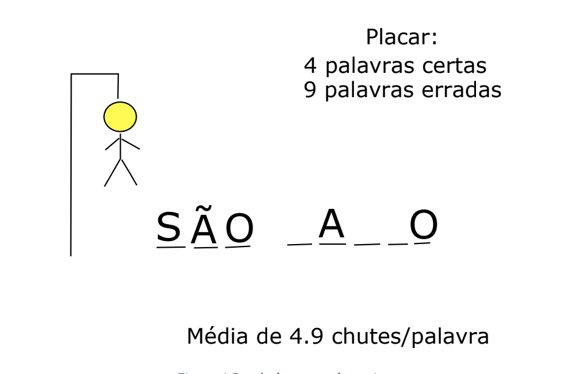

# Hangman

## Description:
This project is a hangman game that makes use of the resources of python programming taught in the first semester of computer engineering at Insper. The game reads a word list from a file and ask the user one letter guess at a time until it gets the word or the hangmen is completed.

## Guidance
Python 3 and the turtle module were used for the interface. This module allows the program to ask data to the user using a graphical window. 

Turtle documentation: https://docs.python.org/3/library/turtle.html

The words used in the game are in a text file. The program can load text files encoded in UTF-8 and containing one word on each line (palavras.txt). Subsequently, the program randomly chooses a word from those loaded from the file.

The file may contain empty lines, which are ignored.

A drawn word is not put into play again unless the program is restarted or the entire list has already been played. 

The program is not case-sensitive.

When a letter is requested from the user, the program does not accept more than a letter or characters that are not letters.

The lines in the file can contain terms composed of more than one word, for example: São Paulo, sea lion, blue whale.

The turn ends when the hangman figure is completed. The hangman has 6 elements (head, trunk, arms, and legs)

At the end of the shift, the user is asked if he wants to play again with another word. The scoreboard shows the average number of tries needed to get a word

